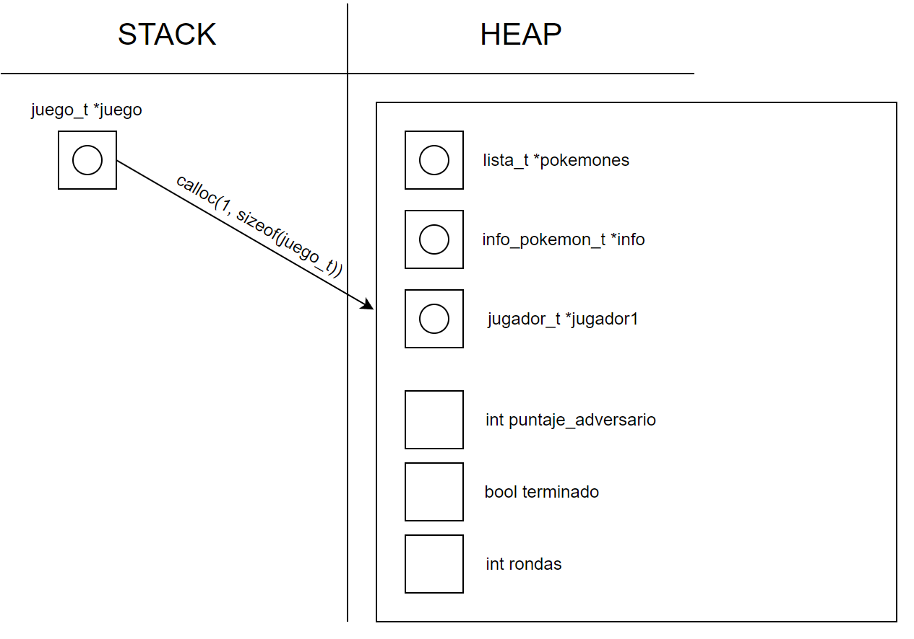

<div align="right">

</div>

# TP2

## Repositorio de Cristian Portolan - 110596 - cportolan@fi.uba.ar

- Para compilar:

```bash
make pruebas_chanutron
```

- Para ejecutar:

```bash
make
```

- Para ejecutar con valgrind:
```bash
make valgrind-chanutron
```
---
##  Funcionamiento

Para este trabajo se pidio implementar un **JUEGO DE POKEMONES** utilizando los TDA's realizados en la materia (TDA Lista / TDA Hash / TDA Abb) en **lenguaje de programacion C**.

Para la implementacion, se debio programar el archivo **juego.c** y **adversario.c**, y ademas realice una biblioteca y otro archivo para organizar el codigo e implementar las funciones correspondientes para que el usuario pueda interactuar con el juego.

Una vez comenzado el juego, ejecutado con el comando mostrado en la seccion de arriba, lo que se muestra es un menu de bienvenida donde nos permite iniciar o salir del juego con las letras `i (iniciar)` o `q (salir)`. Una vez iniciado el juego, pide que se ingrese un archivo que debe tener un formato especial para cargar los pokemones, y para esto se debio utilizar el TP1, que se basaba en leer un archivo y poder cargar la informacion en estructuras.

Una vez cargando el archivo de pokemones correctamente, se deben elegir tres pokemones, llamando a la funcion `juego_seleccionar_pokemon` que van a ser usados para proximamente realizar las jugadas y los ataques. Luego, se llama a `adversario_seleccionar_pokemon` donde se eligen tres pokemones aleatorios y se agregan a la lista de pokemones del adversario junto con sus ataques dentro de otra lista.

Llegado a esta posicion, lo que se debe ir haciendo es ingresar un pokemon y un ataque, y una vez ingresado y validado se llama a `juego_jugar_turno` donde se calculan el resultado de los ataques (efectivo, inefectivo, o error) y los puntajes correspondientes para cada jugador (usuario y adversario). Cuando el usuario ingrese la jugada correctamente, se llama a `adversario_proxima_jugada` donde se elije un pokemon y un ataque aleatorio. 

Una vez ingresadas las nueve jugadas, dependiendo el puntaje final de cada jugador, se imprime un mensaje por pantalla de si ganaste el juego, perdiste o empataste contra la maquina.

<div align="center">

</div>

---

## Respuestas a las preguntas teóricas

- Explicar las estructuras utilizadas para implementar la lógica del juego y del adversario. Cuando utilice algún TDA de los implementados en la materia explique por qué.

Para la logica del juego, en la estructura **juego_t** defini mi info_pokemon_t con la informacion del archivo, que luego todos esos pokemones son pasados a una lista, lista que tambien guardo en juego_t con el nombre de "pokemones". Ademas, tengo mi jugador_t, que es una estructura que no viene definida en el .h del juego, esta estructura contiene dos listas, una lista de pokemones_elegidos y una lista de ataques_disponibles, y un puntaje. Ademas, en mi juego_t defini un puntaje adversario, un booleano que define si el juego termina o no, y un entero rondas, que se encarga de ir contando y guardando la cantidad de rondas jugadas/restantes del juego.

Para el funcionamiento del juego use el `TDA Lista` que implementamos anteriormente. Esto se debe a que utilizar este TDA me permitio poder usar un orden de las cosas muy comodo para acceder, una complejidad optima para las funciones y accesibilidad en las estructuras mediante las funciones del TDA como lista_con_cada_elemento. 

- Explique las complejidades de cada función implementada.

FUNCIONES DE **JUEGO.C**

En `juego_crear`: En esta funcion, lo que se hace es reservar memoria para todo lo que este relacionado con la estructura juego_t. Tenemos un malloc para el juego, y mallocs para las listas que se encuentran dentro de este struct. La complejidad de alloc es despreciable.

En `juego_cargar_pokemon`: En esta funcion comenzamos validando que los punteros no sean nulls, que es constante. Luego, llamamos a pokemon_cargar_archivo, que su complejidad depende de la cantidad de lineas que tengo el archivo que le pasamos a la funcion, por lo tanto realiza sus operaciones n veces. A su vez, si la informacion cargada no cumple con la validacion, se llama a un destructor, el cual tiene un for, por lo tanto realiza sus operaciones n veces relacionada a la cantidad de pokemones cargados, y por ultimo tenemos un con_cada_pokemon, que itera y va llamando a lista_insertar que es constante, por lo tanto tiene complejidad n. Entonces, como complejidad final de juego_cargar_pokemon, podemos decir que es **O(n)**.

En `juego_listar_pokemon`: En esta funcion se devuelve un campo de la estructura juego, la lista de pokemones. Entonces, la complejidad computacional de un solo return es de **O(1)**.

En `juego_seleccionar_pokemon`: En esta funcion se realizan algunas validaciones que tienen complejidad constante, y luego se llama tres veces a lista_buscar_elemento el cual realiza operaciones n veces, dependiendo de la cantidad de elementos en la lista. Luego, se llama a insertar_pokemones_jugador, que tiene llamados a lista_insertar y a con_cada_ataque. Por esta implementacion, podemos decir que sabiendo que con_cada_ataque siempre va a iterar solamente tres veces, es constante, entonces llegando a esa conclusion esta funcion de insertar_pokemones_jugador es constante. Como complejidad final, sumando las complejidades de las funciones llamadas dentro, podemos decir que es **O(n)**.

En `juego_jugar_turno`: En esta funcion, que es una de las principales para poder jugar, se comienza realizando unas validaciones sobre lo recibido, que son constantes. Luego, se llama a listar_buscar_elemento, que tienen de complejidad O(n) porque realizan una iteracion y depende de la cantidad de pokemones que haya en la lista. Luego, de nuevo se hacen dos operaciones que son O(n), que se basan en llamar a la funcion pokemon_buscar_ataque. Luego, se llama a calcular_resultado dos veces, que es una funcion O(1), es decir, que tiene complejidad constante y otro llamado a la funcion de eliminar_ataque_usado, que es O(n). Para finalizar, podemos decir que en el infinito la complejidad computacional de esta funcion es de **O(n)**.

En `juego_obtener_puntaje`: En esta funcion se tienen muchas operaciones constantes, if y return. Por lo tanto, complejidad final es **O(1)**.

En `juego_finalizado`: Solamente se tiene un return en esta funcion, que es devolver un campo de la estructura juego, por lo tanto la complejidad es constante, seria **O(1)**.

En `juego_destruir`: Se comienza llamando a pokemon_destruir_todo que tiene un for, es decir, que itera n veces, por lo tanto se considera de complejidad computacional O(n), luego tenemos tres lista_destruir que se encargan de liberar la memoria almacenada para las listas utilizadas en el juego, que cada lista_destruir tiene un for, por lo tanto tambien son O(n) y un free() que es O(1) es decir tiene complejidad constante. Entonces, la suma total de complejidades computacionales es **O(n)**.

FUNCIONES DE **ADVERSARIO.C**

En `adversario_crear`: Se reserva toda la memoria necesaria para el uso del adversario. Podemos decir que la complejidad malloc/calloc es despreciable.

En `adversario_seleccionar_pokemon`: En adversario seleccionar pokemon tenemos un while, que itera n veces ya que depende de un bool. Luego, dentro del while llamamos a una funcion que realiza tres lista insertar, y tres con cada ataque, que asumimos en esta implementacion que son de complejidad constante ya que siempre realizan la misma cantidad de iteraciones. Luego tenemos un if, que siempre en un if se debe tomar el peor de los casos, por lo tanto, el peor de los casos es cuando se eliminan los elementos de la lista llamando a una funcion aparte, entonces la complejidad final quedaria **O(n^2)**.

En `adversario_pokemon_seleccionado`: Hay tres llamados a lista insertar y returns, esta funcion tiene como complejidad **O(1)**.

En `adversario_proxima_jugada`: En esta funcion lo que se hace es llamar a una funcion aparte de adversario_calcular_jugada, dentro de ellas elegimos un pokemon y un ataque aleatorio, que son O(n), que estan dentro de otro while, que realice n iteraciones, por lo tanto la complejidad final es **O(n^2)**.

En `adversario_destruir`: Se llama tres veces a lista_destruir, eliminando toda la memoria reservada para el adversario, y luego se hace un free. En terminos generales, siendo de complejidad n cada lista_destruir, la complejidad final es **O(n)**.

